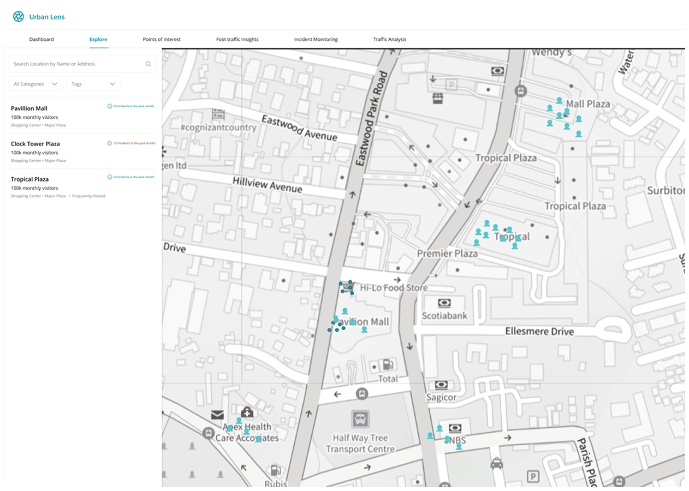

<a id="readme-top"></a>

<!-- PROJECT LOGO -->
<br />
<div align="center">
  

  <h3 align="center">Urban Lens Analytics</h3>

  <p align="center">
    AI-powered analytics platform that transforms live CCTV feeds into actionable traffic insights across Jamaica
    <br />
    <a href="#"><strong>Explore the docs »</strong></a>
    <br />
    <br />
    <a href="#">View Demo</a>
    ·
    <a href="#">Report Bug</a>
    ·
    <a href="#">Request Feature</a>
  </p>
</div>

<!-- TABLE OF CONTENTS -->
<details>
  <summary>Table of Contents</summary>
  <ol>
    <li>
      <a href="#about-the-project">About The Project</a>
      <ul>
        <li><a href="#built-with">Built With</a></li>
      </ul>
    </li>
    <li>
      <a href="#getting-started">Getting Started</a>
      <ul>
        <li><a href="#prerequisites">Prerequisites</a></li>
        <li><a href="#installation">Installation</a></li>
      </ul>
    </li>
    <li><a href="#usage">Usage</a></li>
    <li><a href="#features">Features</a></li>
    <li><a href="#project-structure">Project Structure</a></li>
    <li><a href="#contributing">Contributing</a></li>
    <li><a href="#license">License</a></li>
    <li><a href="#contact">Contact</a></li>
  </ol>
</details>

<!-- ABOUT THE PROJECT -->
## About The Project

Urban Lens is a cutting-edge analytics platform that leverages artificial intelligence to transform live CCTV streams into valuable traffic and urban mobility insights. The platform helps businesses and organizations make data-driven decisions by providing real-time analytics on traffic patterns, vehicle movements, and pedestrian flow across Jamaica.

### Built With

* [![React][React.js]][React-url]
* [![TypeScript][TypeScript]][TypeScript-url]
* [![Vite][Vite]][Vite-url]
* [![TailwindCSS][TailwindCSS]][TailwindCSS-url]
* [![React Query][ReactQuery]][ReactQuery-url]
* [![React Router][ReactRouter]][ReactRouter-url]

<p align="right">(<a href="#readme-top">back to top</a>)</p>

<!-- GETTING STARTED -->
## Getting Started

To get a local copy up and running, follow these steps:

### Prerequisites

* Node.js (Latest LTS version recommended)
* yarn
  ```sh
  npm install -g yarn
  ```

### Installation

1. Clone the repository
   ```sh
   git clone https://github.com/your_username/urban-lens-ui.git
   ```
2. Install dependencies
   ```sh
   yarn install
   ```
3. Create a `.env` file in the root directory
   ```js
   VITE_API_URL=your_api_url_here
   ```
4. Start the development server
   ```sh
   yarn dev
   ```

<p align="right">(<a href="#readme-top">back to top</a>)</p>

<!-- USAGE -->
## Usage

Urban Lens provides several key features:

1. **Dashboard Analytics**: Monitor real-time traffic metrics and patterns
2. **Location Management**: Add and manage multiple locations
3. **Live Stream Monitoring**: View CCTV feeds with AI-powered object detection
4. **Interactive Maps**: Visualize location data and traffic patterns
5. **Custom Reports**: Generate detailed analytics reports

<!-- FEATURES -->
## Features

- **Real-time Analytics**: Monitor live traffic patterns, vehicle movements, and pedestrian flow
- **Location Management**: Track multiple locations with detailed metrics
- **Interactive Dashboard**: Visualize data through real-time charts and location-specific insights
- **Live Stream Integration**: View and analyze CCTV feeds with object detection capabilities
- **Multi-location Support**: Manage and compare analytics across different locations

<!-- PROJECT STRUCTURE -->
## Project Structure

```
src/
├── assets/          # Static assets
├── components/      # Shared components
├── config/         # Configuration files
├── lib/            # Utility functions
├── modules/        # Feature modules
│   ├── auth/       # Authentication
│   ├── core/       # Core functionality
│   ├── locations/  # Location management
│   └── marketing/  # Marketing pages
├── provider/       # Context providers
└── routes/         # Route definitions
```

<!-- CONTRIBUTING -->
## Contributing

1. Fork the Project
2. Create your Feature Branch (`git checkout -b feature/AmazingFeature`)
3. Commit your Changes (`git commit -m 'Add some AmazingFeature'`)
4. Push to the Branch (`git push origin feature/AmazingFeature`)
5. Open a Pull Request

<!-- LICENSE -->
## License

Proprietary software. All rights reserved.

<!-- CONTACT -->
## Contact

Urban Lens Team - support@urbanlens.com

Project Link: [https://github.com/your_username/urban-lens-ui](https://github.com/your_username/urban-lens-ui)

<p align="right">(<a href="#readme-top">back to top</a>)</p>

<!-- MARKDOWN LINKS & IMAGES -->
[React.js]: https://img.shields.io/badge/React-20232A?style=for-the-badge&logo=react&logoColor=61DAFB
[React-url]: https://reactjs.org/
[TypeScript]: https://img.shields.io/badge/TypeScript-007ACC?style=for-the-badge&logo=typescript&logoColor=white
[TypeScript-url]: https://www.typescriptlang.org/
[Vite]: https://img.shields.io/badge/Vite-646CFF?style=for-the-badge&logo=vite&logoColor=white
[Vite-url]: https://vitejs.dev/
[TailwindCSS]: https://img.shields.io/badge/Tailwind_CSS-38B2AC?style=for-the-badge&logo=tailwind-css&logoColor=white
[TailwindCSS-url]: https://tailwindcss.com/
[ReactQuery]: https://img.shields.io/badge/React_Query-FF4154?style=for-the-badge&logo=react-query&logoColor=white
[ReactQuery-url]: https://tanstack.com/query/latest
[ReactRouter]: https://img.shields.io/badge/React_Router-CA4245?style=for-the-badge&logo=react-router&logoColor=white
[ReactRouter-url]: https://reactrouter.com/
